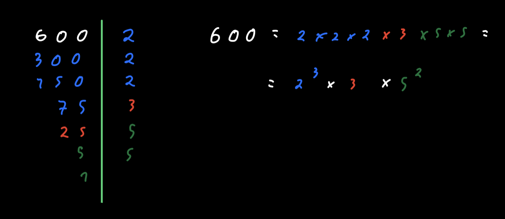

Title: Largest Prime Factor
Author: Force
Date: 21/3/21
Overview: The third challenge from Project Euler making us learn about primes and factoring.
Image: ''

Hey people! 

I'm back with our series on **PE**.

Last time we took a look at one of my favourite pieces of math when I was youger, and today we will look at **prime numbers** and **prime factore**.

## What are prime numbers?

Prime numbers are a complex and a bit misterious topic, they have some amazing properties (like being able to express every even positive number as a sum of two prime numbers). Simply put a Prime Number is:

> A number whose only factors are 1 and the number itself

## Factoring

The factors of a number are the numbers that can be multiplied to give that first number. So the **Prime Factors** of a number are the **Prime numbers** that can be multiplied to give us the first number.

| Numbers|Factors|Nº of Factors|
|:--:    |:--:   |:--:         |
|1       |1|1|
|2       |1,2|2|
|3       |1,3|2|
|4       |1,2,4|3|
|5       |1,5|2|
|6       |1,2,3,6|4|
|7       |1,7|2|
|8       |1,2,4,8|4|
|9       |1,3,9|3|
|10      |1,2,5,10|4|

As we can see the prime numbers bellow 10 are **2,3,5,7** and they all have 2 factors.

For prime factoring a number we basically just divide the number by the lowest prime until we can't divide it more with that number and repeat this process until we get a prime number (so that we divide it by itself and get 1) as seen in the picture bellow.


## The problem

> What is the largest prime factor of the number 600851475143 ?

## The Program

We will start by defining the number we want to check for the largest prime assigning it to the **n** variable and assigning 0 to a **max** variable.

```python
max = 0
n = 600851475143
```

As we saw before all **primes** are larger or equal to 2 (1 doesn't really count as a prime) we can just check numbers from 2 up to **n**.

A non prime number can be factored into the product of two factors, so none of them can be larger than the **square root of the original number**, as that would make the product give a number higher than the  original one we can shallow our interval from 2 up to n to **2 up to sqrt(n)+1** (as the range function does not include the higher number)

```python
# to get the sqrt function
import math

for i in range(2, int(math.sqrt(n))+1):
    # do something
```

Since all **non-prime numbers** can be expressed as a multiplication of two or more primes (ie 4=2x2, 20=5x4=5x2x2,...) we need to use a while loop and see if the original number is divisible by that one:

```python
while n % i == 0:
    n = n / i
```

Then we check if **i** is larger than **max**

```python
while n % i == 0:
    n = n / i
    if i > max:
        max = i
```

To end this problem we just need to print the max value and *Voila* here you have the final program.

```python
import math

n = 600
max = 0
for i in range(2, int(math.sqrt(n))):
    print("----", )
    while n % i == 0:
        n = n / i
        if i > max:
            max = i


print(max)
```

As always I hope you liked this write up. More complex problems are yet to come, but until then **Ask Questions**.

