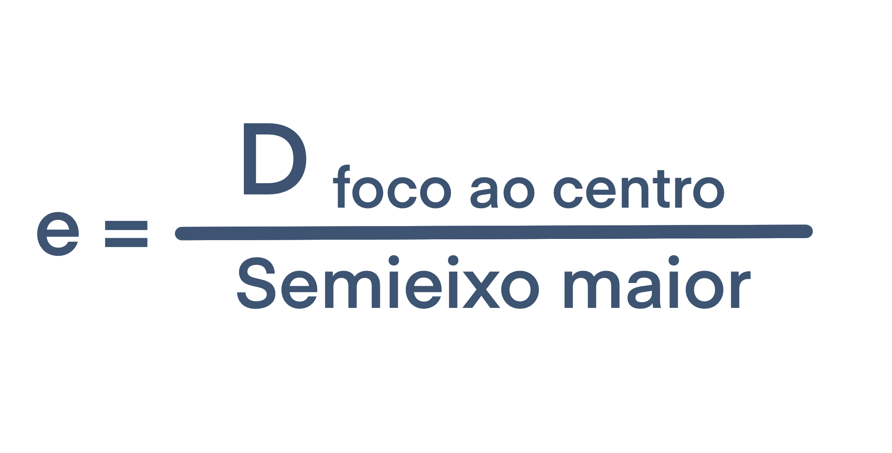
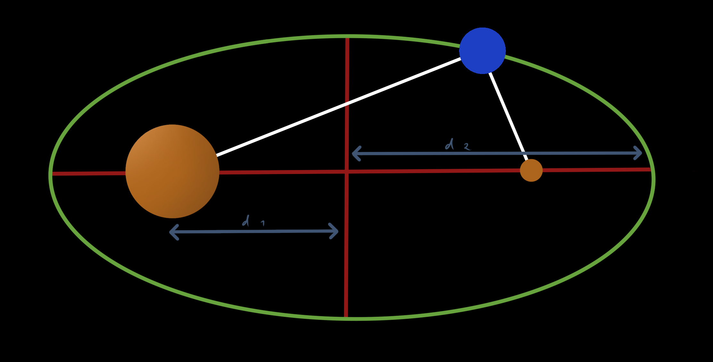
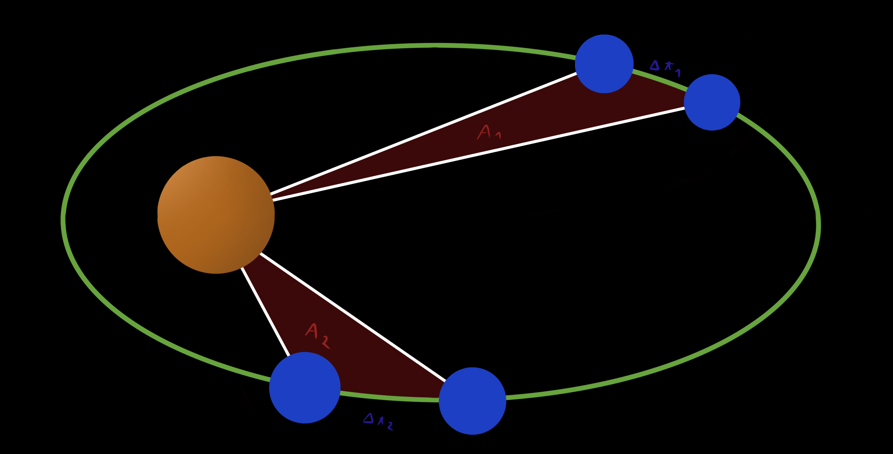
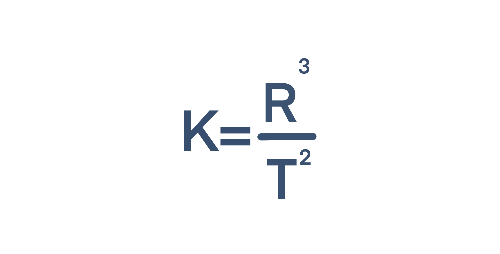

Title: Leis de Kepler
Author: Force
Date: 26/3/21
Overview: (Português) Resumo sobre as leis de Kepler
Image: ''

Olá a todos!
Visto que tenho este website, gosto de escrever e preciso de estudar física, decidi começar a fazer resumos e partilhar os mesmos por aqui.

Como primeiro **Resumo** vamos falar sobre as **Leis de Kepler**.

## Kepler e o Heliocentrismo

Até alguns séculos atrás, era tido como verdade que a *Terra* era o centro do universo e que todos os planetas, estrelas... que podíamos ver no céu noturno giravam à sua volta em diversas esferas celestes. Esta teoria foi popularizada por **Ptolomeu** e era chamada de **Geocentrismo**.

Durante o Século XVI, através das observações de **Galileu**, **Copérnico** formulou uma nova teoria, a teoria **Heliocêntrica**, onde a Terra (assim como os restantes planetas) teriam órbitas em torno do Sol.

Esta teoria seria confirmada por **Kepler**, pois as suas previsões, chamadas de **Leis de Kepler** eram eficazes.

## Primeira Lei

Na antiguidade a geometria era vista como uma prova da perfeição divina, e por isso as órbitas eram consideradas **circulares**. Kepler descobriu que isto não estava certo e que na realidade as órbitas planetárias são **elípticas**.

Uma elipse possui uma característica chamada **excentricidade**, sendo que um círculo tem uma excentricidade nula, e a mesma pode ser calculada por:

Após descobrir que os planetas do nosso sistema solar descreviam órbitas elípticas de baixa excentricidade, Kepler postulou o seguinte:

> Lei das Órbitas: Os planetas descrevem órbitas elípticas em torno do sol, sendo que este ocupa um dos focos.

## Segunda Lei

Apesar de a **Conservação do momento** ainda não ser conhecida na altura em que Kepler propôs a sua segunda lei, esta é uma consequência da conservação do momento, fazendo com que um planeta *aumente a sua velocidade* quando se *aproxima do sol* e a *diminua* quando se *afasta*.

Dada esta mudança de velocidade Kepler deduziu que:

> Lei das Áreas: O vetor posição de um planeta em relação ao Sol precorre Áreas iguais em Intervalos de Tempo iguais.

## Terceira Lei

Kepler descobriu ainda que o *período* de cada planeta (ano/tempo que demora a dar uma volta em torno do sol) estava relacionado com a *distância média* entre esse planeta e o Sol. Através da análise dos dados, Kepler deduziu que:

> Lei dos Períodos: O cubo do Raio é diretamente proporcional ao quadrado do Período.

**K, Constante de Kepler** é constante e depende apenas da massa do Sol, pelo que tem um valor aproximado de *3,36 x 10¹⁸ m³ s⁻²*

## Conclusão

Estas leis foram revolucionárias na época, acabando com a suposição de que as órbitas planetárias eram circulares, mas elas não explicam porquê.

As Leis de Kepler descrevem o movimento descrito pelos planetas, mas não explicam as forças que o causam, sendo que isso só seria explicado através da **Gravidade**

