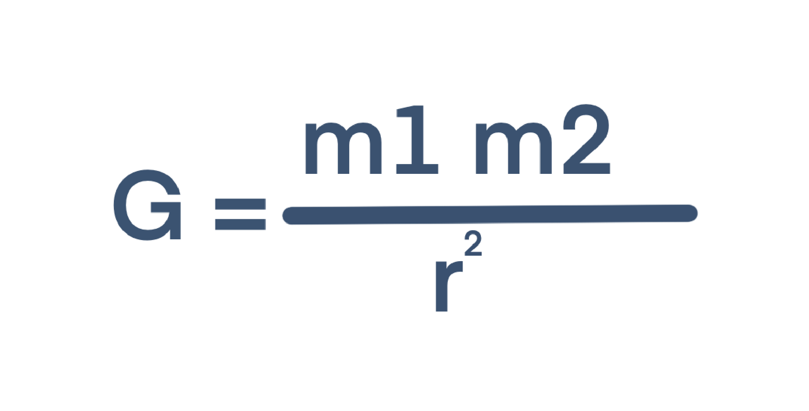
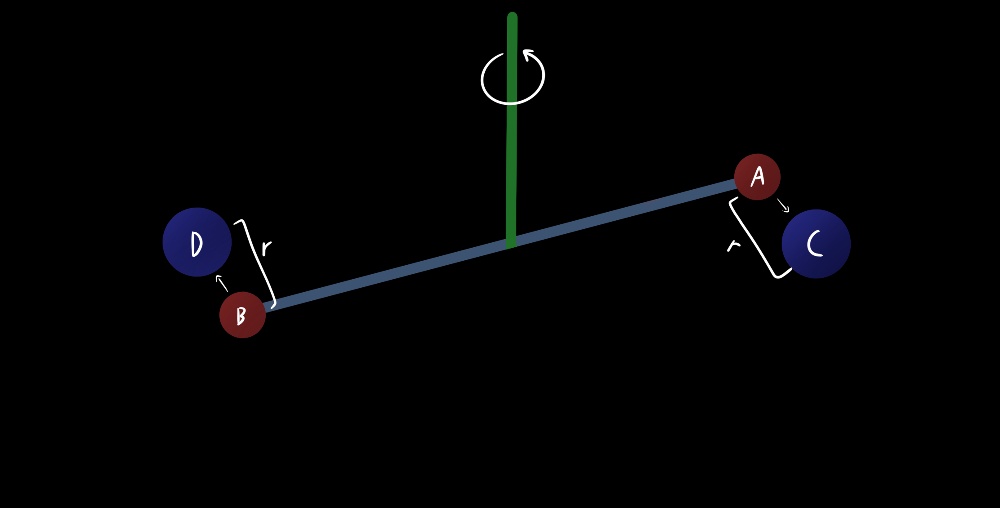
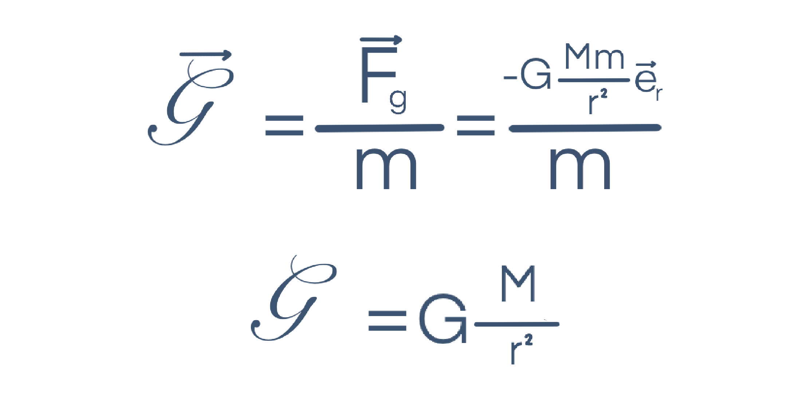
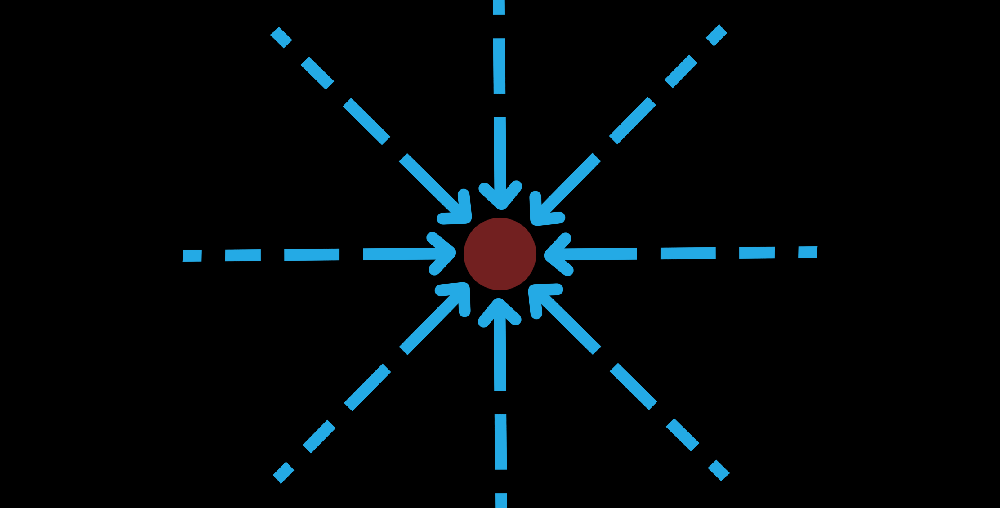

Title: Lei da Gravitação Universal
Author: Force
Date: 3/4/21
Overview: (Português) Resumo sobre a Lei da Gravitação Universal e do Campo Gravítico
Image: ''

Anterior: [Leis de Kepler](./kepler.html)
Olá outra vez.

No último artigo falamos sobre as *Leis de Kepler*, mas também percebemos que estas não explicam o porquê de os corpos celestes terem o seu movimento. Este facto é explicado por **Newton e as suas Leis**

## Contextualização Histórica
A lenda diz que certo dia, Newton estava deitado por baixo de uma árvore, quando a queda de uma maçã lhe originou uma epifania.

Newton vinha a estudar o movimento planetário, assim como balística (essencialmente o movimento de projéteis), mas só nesse momento percebeu que a força responsável por esses dois efeitos era a mesma, a Gravidade.

## Lei da Gravitação Universal
Através dos seus cálculos, e da aplicação das leis determinadas por Kepler, Newton consegui propor a sua **Lei da Gravitação Universal**, podendo assim a intensidade da força exercida entre dois corpos de massas *m1 e m2* ser traduzida pela seguinte fórmula:

> F: Intensidade da força gravítica
> m1: Massa do corpo 1
> m2: Massa do corpo 2
> r²: Quadrado da distância entre os centros de massa dos dois corpos
> G: constante de gravitação universal 6.67x10⁻¹¹ N m² kg⁻²

Apesar de **G** ser bastante importante para esta lei, o valor da mesma apenas foi determinado cerca de 100 anos mais tarde através da **experiência de Cavendish**:

Esta experiência consiste na colocação de *duas massas pequenas (A e B)* nas extremidades de uma *barra* suspensa por um *fio*. São também colocadas *duas massas maiores e amovíveis (C e D)* afastadas das mais pequenas por uma *distância r*. As massas *A e B* serão atraídas para *C e D*, pelo que o fio será torcido e através dessa mesma torção será possível determinar **G**. 

> Lei da Gravitação Universal: Entre dois corpos, A e B de massas m1 e m2 respetivamente, existe uma força diretamente proporcional ao produto entre as suas massas e inversamente proporcional ao quadrado da distância entre os seus centros de massa.

## Campo Gravítico

Assim como acontece com cargas elétricas, também todas as massas *m* num certo **campo gravítico** ficam sujeitas a uma determinada interação.

O **Campo Gravítico** é utilizaqdo como uma forma de descrever a açãode uma massa *M* independentemente da massa *m* da segunda partícula, pelo que:

Este Campo é por isso **radial**, **centrípeto** e pode ser representado por **Linhas de campo** que nunca se cruzam:

Caso estejam interessados em saber a intensidade do vosso campo gravítico podem tentar clicar [aqui](https://editor.p5js.org/Force4760/present/aO_q3X6b7).

## Conclusão

Newton foi um verdadeiro génio. Descobriu o cálculo, várias leis físicas, publicou uma das obras mais importantes da história da ciência, o [Principia](https://www.amazon.com/-/es/Sir-Isaac-Newton-ebook/dp/B017CXNRKC/ref=pd_sim_3?pd_rd_w=4NBik&pf_rd_p=dc435707-6f1f-492e-b80d-8408db56abc9&pf_rd_r=WRYBQ3YQ089WY134DN4F&pd_rd_r=ec8ec695-c4fb-411e-a9c8-3f44a736a2a3&pd_rd_wg=w0rdh&pd_rd_i=B017CXNRKC&psc=1) e é através das suas descobertas que muita da ciência moderna é possível.

No próximo artigo falaremos um pouco mais sobre o Campo Gravítico e consequências do mesmo.